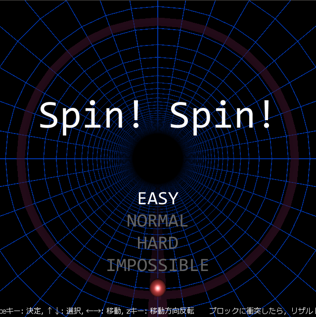
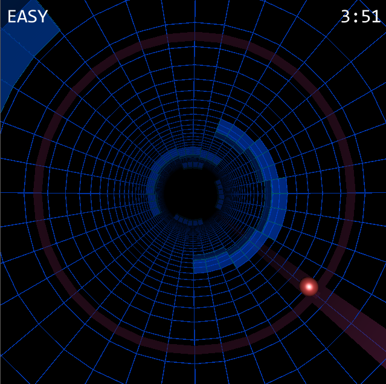

# Spin! Spin!

東京工業大学2015工大祭で、ロボット技術研究会 CG-SQUAREとして展示したゲームです。

 

※画像は開発中のものです。

### ゲーム概要

- タイトル「Spin! Spin!」
- 製作者
    - ゲーム: Ark ([http://arkark.github.io/](http://arkark.github.io/))
    - 音楽: Hydria a.k.a Hornet (Twitter: [@HydroEuphoria](https://twitter.com/HydroEuphoria?lang=ja ), SoundCloud: [soundcloud.com/hydria_hornet](https://soundcloud.com/hydria_hornet))
- ジャンル: 3D障害物避けゲーム
- 開発環境: VC++, DXライブラリ
- 必須動作環境
    - Windows98以降のOS
    - DirectX9以降がインストールされていること

迫り来るブロックを避けてタイムを競おう。反射神経の限界に挑め！

奥から次々と迫り来るブロックを避け続け、どれだけ長く避けられるかを競うゲームです。
一度でもブロックに当たるとゲームオーバー。
ステージはEASY、NORMAL、HARD、IMPOSSIBLEの４ステージあります。

### 操作方法

- Enterキー or Spaceキー: 決定
- ↑↓: 選択
- ←→: 移動
- zキー: 移動方向反転
- ブロックに衝突したら、リザルト画面が表示される前にEnterキー or Spaceキーを連打または長押しすることでショートカットしてリスタート

### 免責事項

本ゲームを使用したことによって生じたすべての障害・損害・不具合等に関しては、私と私の関係者および私の所属するいかなる団体・組織とも、一切の責任を負いません。各自の責任においてご使用ください。

### ダウンロード
[こちら](https://github.com/ArkArk/Spin_Spin_/releases/tag/v1.0.0)のSpin.Spin.zipをダウンロードしてください。
